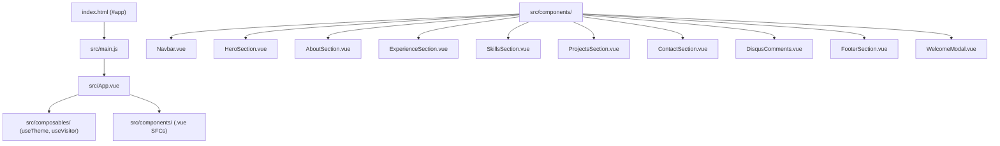

# Vue 3 System & Architecture Documentation

Dokumen ini menjelaskan rancangan arsitektur, struktur folder, konvensi penulisan Single File Components (`.vue`), serta reaktivitas pada **Okta Maulana - Software Engineer Portfolio Website (Vue 3 + Vite)**.

---

## 1. High-Level Architecture Overview

Aplikasi ini dibangun menggunakan **Vue 3 (Composition API)**, **Vite**, dan **Tailwind CSS v3**.



---

## 2. Directory Structure & Organization

```text
2026-web-portfolio-okta/
├── ARCHITECTURE.md            # Dokumentasi arsitektur Vue 3
├── README.md                  # Petunjuk pengembang & jalankan proyek Vue
├── index.html                 # Root HTML template (#app mount point)
├── vite.config.js             # Konfigurasi Vite & Vue 3 plugin
├── tailwind.config.js         # Konfigurasi Tema Tailwind CSS
├── postcss.config.js          # Konfigurasi PostCSS
├── package.json               # Dependencies & Vue build scripts
└── src/
    ├── main.js                # Entrypoint aplikasi Vue 3
    ├── App.vue                # Main Root Vue Component
    ├── assets/
    │   └── css/
    │       └── main.css       # Tailwind & Custom Design System CSS
    ├── composables/           # Shared Reactive Logic (Composition API)
    │   ├── useTheme.js        # Reaktif Dark/Light mode manager & Disqus sync
    │   └── useVisitor.js      # Reaktif Visitor modal & LogRocket identification
    └── components/            # Vue Single File Components (.vue)
        ├── WelcomeModal.vue   # Modal sambutan pengunjung pertama
        ├── Navbar.vue         # Responsive header & mobile menu drawer
        ├── HeroSection.vue    # Hero title, typewriter, social links
        ├── AboutSection.vue   # Bio & Personal Overview
        ├── ExperienceSection.vue # Career timeline
        ├── SkillsSection.vue  # Skill progress bars & tech badges
        ├── ProjectsSection.vue # Portfolio grid & category filter
        ├── ContactSection.vue  # Contact form & info cards
        ├── DisqusComments.vue  # Comment thread integration
        └── FooterSection.vue  # Footer & copyright
```

---

## 3. Component Breakdown & Responsibilities

1. **`App.vue`**: Mengaitkan seluruh komponen section secara terstruktur dan mengeksekusi inisialisasi awal.
2. **`useTheme.js`**: Reaktif composable menggunakan Vue `ref` untuk menyimpan state tema gelap/terang di `localStorage` dan mensinkronisasikan iframe Disqus.
3. **`useVisitor.js`**: Reaktif composable untuk kontrol modal pengunjung pertama dan integrasi LogRocket identification.
4. **`Navbar.vue`**: Mengontrol pembukaan drawer menu mobile dan penandaan link aktif sesuai posisi scroll.
5. **`HeroSection.vue`**: Menampilkan efek ketik peran (typewriter) secara interval reaktif.
6. **`SkillsSection.vue`**: Animasi persentase skill bar terhitung secara reaktif saat komponen di-mount.
7. **`ProjectsSection.vue`**: Filtering kategori project (*All, Web, Mobile, UI/UX*) secara reaktif menggunakan `computed()` property.

---

## 4. Build Pipeline & Commands

```bash
# Menjalankan Dev Server Vite (Hot Module Replacement super cepat)
npm run dev

# Kompilasi & bundling produksi dengan Vite
npm run build

# Meninjau build produksi secara lokal
npm run preview
```
